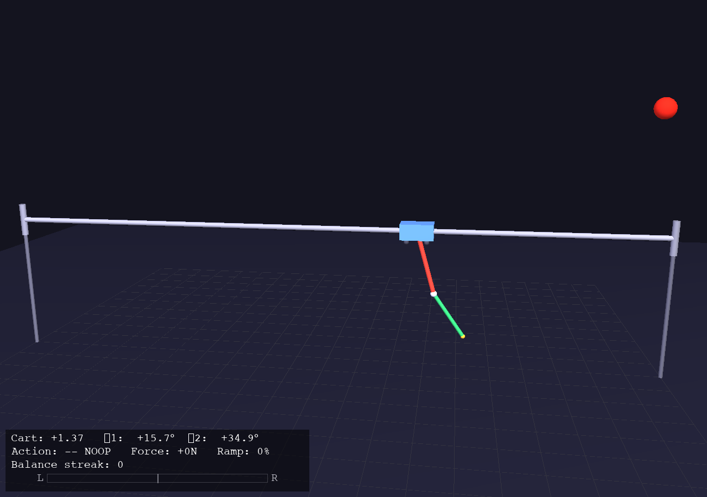

# DualPendulumGym

A cart-double-pendulum swing-up and balance environment with 3D OpenGL rendering, built on [Gymnasium](https://gymnasium.farama.org/). Train an RL agent to swing two hinged rods upright and keep them balanced using only horizontal cart forces.

<p align="center">
  
</p>

## The Problem

A cart slides along a horizontal rail. Two rods are connected by hinges: rod 1 hangs from the cart, rod 2 hangs from the tip of rod 1 (like nunchucks). The only control input is pushing the cart left or right. The goal is to swing both rods from their natural hanging position to fully upright, and **sustain** the balance for as long as possible.

This is a classic underactuated control problem. The system has 3 degrees of freedom (cart position, rod 1 angle, rod 2 angle) but only 1 control input, making it significantly harder than a single inverted pendulum.

## Features

- **Lagrangian physics** with RK4 integration (4 substeps per step, 0.006% energy drift over 200s)
- **3D OpenGL rendering** with real-time HUD showing action, force bar, balance streak
- **Human play mode** with keyboard control and demo recording
- **Three-stage training pipeline**: SFT (behavioral cloning) -> GRPO (Group Relative Policy Optimization)
- **Adaptive force ramping**: sustained pushing in one direction increases force magnitude
- **Status lights**: red (rods below) -> green (both above horizontal) -> blue (rod 2 above rod 1)

## Architecture

```
dual_pendulum_gym/
  physics/dynamics.py      # Lagrangian EOM, RK4 integrator, PhysicsParams
  envs/dual_pendulum.py    # Gymnasium env, reward function, observation space
  rendering/renderer.py    # PyOpenGL 3D renderer with HUD
  training/
    actor_critic.py        # Shared MLP policy network (14 -> 128 -> 128 -> 3)
    sft.py                 # Stage 1: Behavioral cloning from human demos
    train.py               # Stage 2: GRPO training with parallel environments
  play.py                  # Human play mode with demo recording
  eval.py                  # Evaluate trained models with rendering
```

## Physics

The system uses Lagrangian mechanics to derive exact equations of motion for the coupled cart-pendulum system:

| Parameter | Value | Description |
|-----------|-------|-------------|
| Cart mass | 20.0 kg | Heavy cart for stable base |
| Rod 1 mass | 0.3 kg | Light rods relative to cart |
| Rod 2 mass | 0.5 kg | Slightly heavier outer rod |
| Rod 1 length | 1.0 m | |
| Rod 2 length | 0.8 m | |
| Force (min/max) | 80 / 250 N | Ramps up with sustained pushing |
| Rail length | 10.0 m | Cart crashes at limits |
| Cart friction | 8.0 N*s/m | Viscous rail friction |
| Joint damping | 0.1 N*m*s/rad | Light hinge damping |

**Adaptive force**: When the cart is pushed in the same direction for consecutive frames, the force ramps from 80N to 250N over 30 frames. Reversing direction resets to 80N. This encourages the pumping motion needed for swing-up.

## Observation Space (14-dim)

| # | Feature | Range | Description |
|---|---------|-------|-------------|
| 1 | `x_norm` | [-1, 1] | Cart position (+-1 = wall) |
| 2 | `x_dot` | unbounded | Cart velocity |
| 3 | `x_accel` | unbounded | Cart acceleration |
| 4 | `sin(th1)` | [-1, 1] | Rod 1 angle (no discontinuity) |
| 5 | `cos(th1)` | [-1, 1] | Rod 1 angle |
| 6 | `sin(th2)` | [-1, 1] | Rod 2 angle |
| 7 | `cos(th2)` | [-1, 1] | Rod 2 angle |
| 8 | `th1_dot` | unbounded | Rod 1 angular velocity |
| 9 | `th2_dot` | unbounded | Rod 2 angular velocity |
| 10 | `y_rod1` | [-1, 1] | Rod 1 tip height (normalized) |
| 11 | `y_rod2` | [-1, 1] | Rod 2 tip height (normalized) |
| 12 | `idle_time` | [0, 1] | Time since rod 1 was above horizontal |
| 13 | `force_ramp` | [0, 1] | Current force ramp level |
| 14 | `balance_streak` | [0, 1] | Consecutive balanced steps |

Using `sin/cos` instead of raw angles avoids the discontinuity at +-pi. Rod tip heights and balance streak give the model direct access to reward-relevant features.

## Reward Design

The reward function has two phases:

**Swing-up phase** (either rod below horizontal):
- Center-of-mass height: `1.0 * h1_norm + 3.0 * h2_norm` (rod 2 weighted 3x)
- Progress reward: delta in CoM height, amplified 3x
- Idle penalty: escalating penalty if rod 1 stays below horizontal for 200+ steps

**Balance phase** (both rods above horizontal):
- CoM height multiplied by a **streak multiplier** (1x -> 3x over 200 sustained steps)
- Stability bonus for low angular velocity (rewards stillness, not spinning)
- Spin penalty for angular velocity > 4 rad/s (prevents "big loop" cheating)

**Always active:**
- Wall crash: -10 penalty + episode termination
- Wall proximity: penalty kicks in at 80% toward wall edge

This design was iterated multiple times to close reward-hacking exploits (spinning, wall-riding, idle oscillation).

## Training Pipeline

### Stage 1: Supervised Fine-Tuning (SFT)

Record human demonstrations, then train the policy via behavioral cloning:

```bash
# Record demos (arrows = move, ESC = quit)
python -m dual_pendulum_gym.play --record demos/human_demo.npz

# Train SFT model
python -m dual_pendulum_gym.training.sft --demos "demos/human_demo.npz" --save-path checkpoints/model_sft.pt
```

SFT gives the agent a reasonable starting policy (~95% action accuracy) so RL doesn't start from random behavior.

### Stage 2: GRPO (Group Relative Policy Optimization)

GRPO is a critic-free RL algorithm inspired by [DeepSeek-Math](https://arxiv.org/abs/2402.03300). Instead of training a value function to estimate advantages, it:

1. Runs **N parallel trajectories** (default 4) from the current policy
2. Ranks them by total reward within the group
3. Computes **group-relative advantages**: `(reward - group_mean) / group_std`
4. Updates using a PPO-style clipped surrogate objective

```bash
# GRPO training from SFT checkpoint (with real-time rendering)
python -m dual_pendulum_gym.training.train \
    --pretrained checkpoints/model_sft.pt \
    --render --render-fps 120 \
    --group-size 4 --max-episodes 5000
```

**Why GRPO over PPO?** Standard PPO requires a critic network to estimate state values. In our experiments, the critic was often poorly calibrated, causing policy collapse (the agent would suddenly start crashing into walls). GRPO eliminates the critic entirely -- the "baseline" is just the group mean reward, which is always accurate by construction.

### Training Results

| Method | Avg Reward (100-ep) | Stability |
|--------|-------------------|-----------|
| A2C | -80 (collapsed) | Policy collapse after ~12 episodes |
| PPO | 1,000 | Gradual degradation |
| **GRPO** | **930+** (and rising) | Stable, no collapse |

GRPO with the center-of-mass reward achieved sustained training improvement over 250+ groups without any policy collapse.

## Quick Start

```bash
# Install
pip install -e ".[train]"

# Play as human
python -m dual_pendulum_gym.play

# Record demos for SFT
python -m dual_pendulum_gym.play --record demos/my_demo.npz

# SFT from demos
python -m dual_pendulum_gym.training.sft --demos "demos/my_demo.npz"

# GRPO training
python -m dual_pendulum_gym.training.train --pretrained checkpoints/model_sft.pt --render

# Evaluate a trained model
python -m dual_pendulum_gym.eval --model checkpoints/model_best.pt
```

## Use as a Gymnasium Environment

```python
import gymnasium as gym
import dual_pendulum_gym

env = gym.make("DualPendulum-v0", render_mode="human")
obs, info = env.reset()

for _ in range(1000):
    action = env.action_space.sample()  # 0=left, 1=noop, 2=right
    obs, reward, terminated, truncated, info = env.step(action)
    if terminated or truncated:
        obs, info = env.reset()

env.close()
```

## Requirements

- Python >= 3.9
- gymnasium, numpy, pygame, PyOpenGL
- PyTorch >= 2.0 (for training only)

## Lessons Learned

1. **Reward hacking is real**: The agent found every shortcut -- spinning in big loops, oscillating at the bottom, riding walls. Each exploit required a targeted reward fix.
2. **SFT before RL is critical**: Pure RL from scratch leads to wall-crashing within 12 episodes. Starting from human demonstrations gives a viable base policy.
3. **Critic-free RL (GRPO) is more robust**: Removing the value network eliminated the main source of training instability for this task.
4. **Observation design matters**: Switching from raw angles to `sin/cos` encoding, adding rod tip heights, and including task-relevant features (balance streak, force ramp) dramatically improved learning.
5. **Adaptive force ramping** encourages the natural pumping motion that humans intuitively use for swing-up.

## License

MIT
